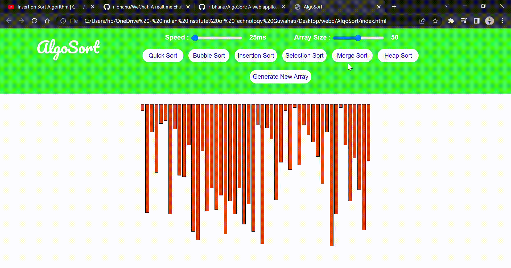

# AlgoSort
AlgoSort is a web app for visualizing a bunch of different sorting algorithms Like

1.Selection Sort<br/>
2.Bubble Sort<br/>
3.Insertion Sort<br/>
4.Merge Sort<br/>
5.Quick Sort<br/>
6.Heap Sort<br/>

## Demo GIF

<br/>

## Installation

Cloning the repository:

```bash
$ git clone https://github.com/r-bhanu/AlgoSort.git
$ cd AlgoSort
```
start the application on http://localhost:3000/
